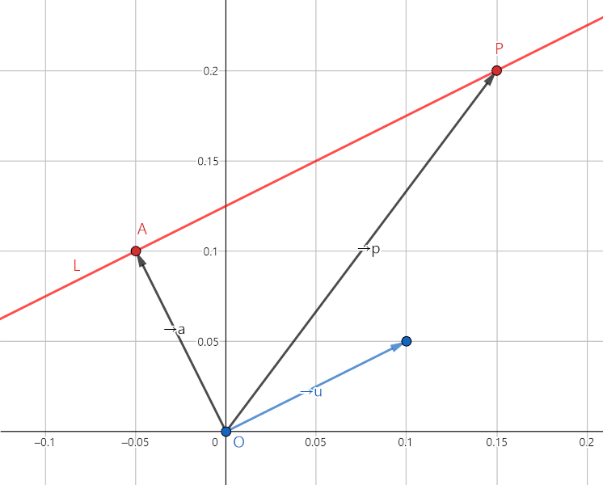

# 선분 교차 판정

2차원 좌표 평면 위에 존재하는 두 선분의 교차 판정은 다음과 같이 확인할 수 있다.

## [평면 벡터를 이용한 직선의 방정식](https://stackoverflow.com/questions/563198/how-do-you-detect-where-two-line-segments-intersect)

 

- 먼저, 두 선분을 방향 벡터를 이용하여 벡터 방정식으로 나타낸다.

$\vec{l_{1}} = \vec{p} + t\vec{r}\ (단,\ t는\ 실수)$  
$\vec{l_{2}} = \vec{q} + u\vec{s}\ (단,\ u는\ 실수)$

- 두 선분의 교점을 구하기 위해, 두 벡터 방정식을 연립한다.

$\vec{p} + t\vec{r} = \vec{q} + u\vec{s}$

- 양변에 벡터의 외적을 적용한다.

$(\vec{p} + t\vec{r}) \times \vec{s} = (\vec{q} + u\vec{s}) \times \vec{s}$

- $\vec{s} \times \vec{s} = 0$이므로, 위 방정식을 더 간단하게 줄일 수 있다.

$t (\vec{r} \times \vec{s}) = (\vec{q} - \vec{p}) \times \vec{s}$

- 따라서 $t, u$는 아래와 같이 표현할 수 있다.

$t = ((\vec{q} - \vec{p}) \times \vec{s}) \ / \ (\vec{r} \times \vec{s})$  
$u = ((\vec{q} - \vec{p}) \times \vec{r}) \ / \ (\vec{r} \times \vec{s})$

- 여기서 $\vec{r} \times \vec{s} = 0$이라면, 두 선분이 한 직선 위에 있거나 평행함을 알 수 있으며, $\vec{r} \times \vec{s} \neq 0$이고 $0 \leq t \leq 1$, $0 \leq u \leq 1$라면 두 선분이 한 점에서 만남을 알 수 있다.