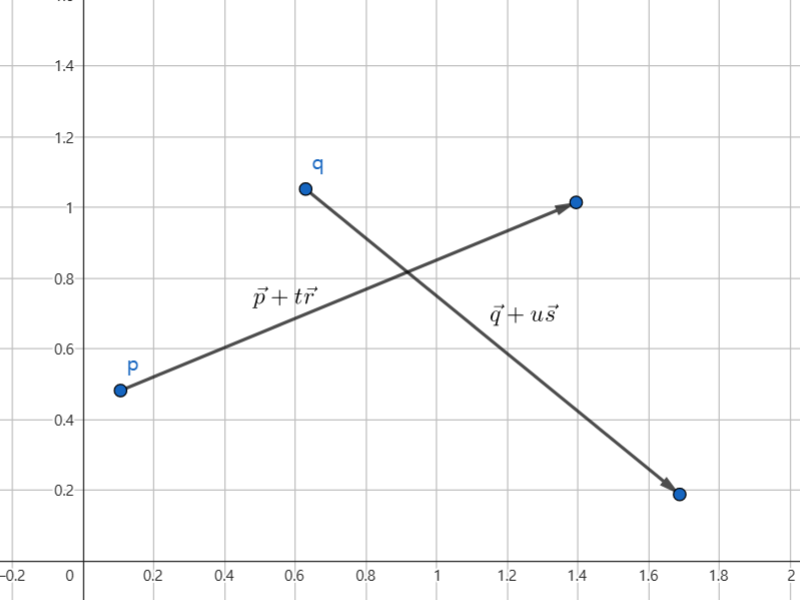

# 광선 투사

## 선분 교차 판정

<br>

<br />

먼저, 각 선분을 벡터 방정식으로 표현해보자.

$\vec{u} = \vec{p} + t\vec{r}\ (단,\ t는\ 실수)$  
$\vec{v} = \vec{q} + u\vec{s}\ (단,\ u는\ 실수)$

<br />

우리의 목표는 아래 식을 만족하는 $t$와 $u$의 값을 찾는 것이다.

$\vec{p} + t\vec{r} = \vec{q} + u\vec{s}$

<br />

이때, ${p_x} + t{r_x} = {q_x} + u{s_x}$ 와 ${p_y} + t{r_y} = {q_y} + u{s_y}$ 를 연립해서 $t$와 $u$를 찾는 방법도 있지만, 여기서는 양변에 벡터의 외적을 적용하는 방법을 사용한다.

$(\vec{p} + t\vec{r}) \times \vec{s} = (\vec{q} + u\vec{s}) \times \vec{s}$

<br />

$\vec{s} \times \vec{s} = 0$이므로, 위 방정식을 더 간단하게 표현할 수 있다.

$t\vec{r} \times \vec{s} = t (\vec{r} \times \vec{s}) = (\vec{q} - \vec{p}) \times \vec{s}$

<br />

따라서 $t, u$는 아래와 같이 표현할 수 있다.

$t = ((\vec{q} - \vec{p}) \times \vec{s}) \ / \ (\vec{r} \times \vec{s})$  
$u = ((\vec{q} - \vec{p}) \times \vec{r}) \ / \ (\vec{r} \times \vec{s})$

<br />

여기서 $\vec{r} \times \vec{s} = 0$이라면, 두 선분이 한 직선 위에 있거나 ($(\vec{q} - \vec{p}) \times \vec{r} = 0$) 평행함 ($(\vec{q} - \vec{p}) \times \vec{r} \neq 0$)을 알 수 있으며, $\vec{r} \times \vec{s} \neq 0$이고 $0 \leq t \leq 1$, $0 \leq u \leq 1$인 경우에만 두 선분이 한 점에서 만남을 알 수 있다.

<br />

```c
typedef struct { Vector2 origin, direction; } Ray;

int compute_intersection_rays(Ray m, Ray n, float *_t) {
    const float rXs = vector2_cross(m.direction, n.direction);

    const Vector2 qp = vector2_subtract(n.origin, m.origin);

    const float qpXs = vector2_cross(qp, n.direction);
    const float qpXr = vector2_cross(qp, m.direction);

    if (rXs != 0.0f) {
        /* 두 선분의 기울기가 서로 다를 때는 `t`와 `u`의 값만 확인하면 된다. */

        const float _rXs = 1.0f / rXs;

        const float t = qpXs * _rXs, u = qpXr * _rXs;

        if ((t >= 0.0f && t <= 1.0f) && (u >= 0.0f && u <= 1.0f)) {
            if (_t != NULL) *_t = t;

            // 두 선분이 한 점에서 만난다.
            return 1;
        }

        return 0;
    } else {
        /* 두 선분의 기울기가 서로 같을 때는 `qpXr`의 값을 확인한다. */

        // 두 선분은 평행하며 서로 만나지 않는다.
        if (qpXr != 0.0f) return 0;

        const float rDr = vector2_dot(m.direction, m.direction);
        const float sDr = vector2_dot(n.direction, m.direction);

        const float _rDr = 1.0f / rDr;

        const float qpDr = vector2_dot(qp, m.direction);

        float k, t0 = qpDr * _rDr, t1 = t0 + sDr * _rDr;

        // 두 선분의 진행 방향이 서로 반대인 경우...?
        if (sDr < 0.0f) k = t0, t0 = t1, t1 = k;

        // 두 선분이 한 선분의 시작 지점 또는 끝 지점에서 만나는 경우...?
        if ((t0 < 0.0f && t1 == 0.0f) || (t0 == 1.0f && t1 > 1.0f)) {
            // `t1`이 0일 경우 시작 지점, `t0`이 1일 경우 끝 지점에서 만난다.
            if (_t != NULL) *_t = (t0 == 1.0f) ? 1.0f : 0.0f;

            return 1;
        }

        return 2 * (t1 >= 0.0 && t0 <= 1.0);
    }
}
```

<br />

## 원으로의 광선 투사

<!--

<br>

-->

- ...

<br />

## 다각형으로의 광선 투사

<!--

<br>

-->

```c
typedef struct { Vector2 point; float dsq; } RaycastHit;

int raycast_poly(const Polygon *s, Ray k, RaycastHit *r) {
    if (s == NULL || s->n < 3) return 0;

    int result = 0, intersection_count = 0;

    if (r != NULL) r->point.x = r->point.y = r->dsq = INT_MAX;

    for (int j = s->n - 1, i = 0; i < s->n; j = i, i++) {
        const Ray l = { 
            .origin = s->vertices[i],
            .direction = vector2_subtract(s->vertices[j], s->vertices[i])
        };

        float t = 0.0f;

        int intersects = compute_intersection_rays(k, l, &t);

        if (intersects) {
            result = 1, intersection_count++;

            if (r != NULL && intersects == 1) {
                const Vector2 point = vector2_add(
                    k.origin, 
                    vector2_scalar_multiply(k.direction, t)
                );

                const float dsq = vector2_distance_sq(k.origin, point);

                if (r->dsq > dsq) r->point = point, r->dsq = dsq;
            }
        }
    }

    return result + (intersection_count & 1);
}
```

<br />

## 참고 자료

- [www.math.ucla.edu: Understanding the Dot Product and the Cross Product](https://www.math.ucla.edu/~josephbreen/Understanding_the_Dot_Product_and_the_Cross_Product.pdf)
- [scratchapixel.com: A Minimal Ray-Tracer: Rendering Simple Shapes (Sphere, Cube, Disk, Plane, etc.)](https://www.scratchapixel.com/lessons/3d-basic-rendering/minimal-ray-tracer-rendering-simple-shapes/parametric-and-implicit-surfaces.html)
- [scratchapixel.com: Ray-Tracing: Generating Camera Rays](https://www.scratchapixel.com/lessons/3d-basic-rendering/ray-tracing-generating-camera-rays/definition-ray.html)
- [stackoverflow.com: How do you detect where two line segments intersect?](https://stackoverflow.com/questions/563198/how-do-you-detect-where-two-line-segments-intersect/565282#565282)

<br />